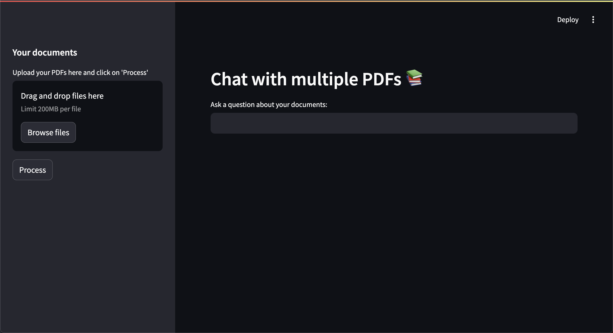

# 🤖 IntelliDocs-RAG: Offline PDF Chatbot with RAG & Local LLM



**IntelliDocs-RAG** is a smart, offline chatbot that allows you to interact with your personal PDF documents securely — **without needing an internet connection**. Powered by a Retrieval-Augmented Generation (RAG) workflow and a locally hosted LLM (via Ollama), the system delivers fast, context-aware responses by understanding and referencing multiple uploaded PDFs.

This tool was created as a **Final Year B.Tech Project** at the **National Institute of Technology, Kurukshetra (NIT Kurukshetra)**.

---

## 🎓 Team Members

- **Kushagra Agarwal**  
- **Shakeeb Parwez**  
- **Ayush Goyal**

**Project Supervisor:** *Dr. Sweeti Sah, Assistant Professor*

---

## 🧠 Practical Scenario

> **Think of a field researcher** stationed in an area with no internet access. They have several research papers stored locally and need quick insights from them. Using **IntelliDocs-RAG**, they can ask:  
>
> *"Summarize the findings in paper 2."*  
> *"Which papers involve time-series analysis with neural networks?"*  
>
> The system analyzes the content and returns precise answers using a local LLM — ensuring speed, privacy, and ease of use.

---

## 🔐 Why Choose IntelliDocs-RAG?

Many current AI-based document tools rely heavily on cloud services like OpenAI or Google, which introduces:

- ❌ **Network dependency**
- ❌ **Data privacy risks**
- ❌ **Costs and API limitations**

**IntelliDocs-RAG** addresses these challenges with:

✅ **Fully Offline Processing via Ollama**  
✅ **Privacy-First Design** using local embeddings and search  
✅ **Open Source & Easily Adaptable for Niche Domains**

---

## ⚙️ Tech Stack Overview

| Component         | Technology                            | Role                                         |
|------------------|----------------------------------------|----------------------------------------------|
| **User Interface**| Streamlit                             | Enables user interaction and document upload |
| **PDF Handling**  | PyPDF2                                | Extracts text content from PDFs              |
| **Text Processing**| LangChain CharacterTextSplitter      | Breaks down text for context retention       |
| **Embeddings**    | OllamaEmbeddings (`deepseek-r1:1.5b`) | Generates semantic representations           |
| **Vector Search** | FAISS                                 | Locates relevant content quickly             |
| **LLM Engine**    | Ollama with `deepseek-r1`             | Handles response generation locally          |
| **Prompt Logic**  | LangChain PromptTemplate              | Structures the input for the LLM             |

---

## 🚀 Getting Started

### 1. Clone this Repository

```bash
git clone https://github.com/your-username/intellidocs-rag.git
cd intellidocs-rag
